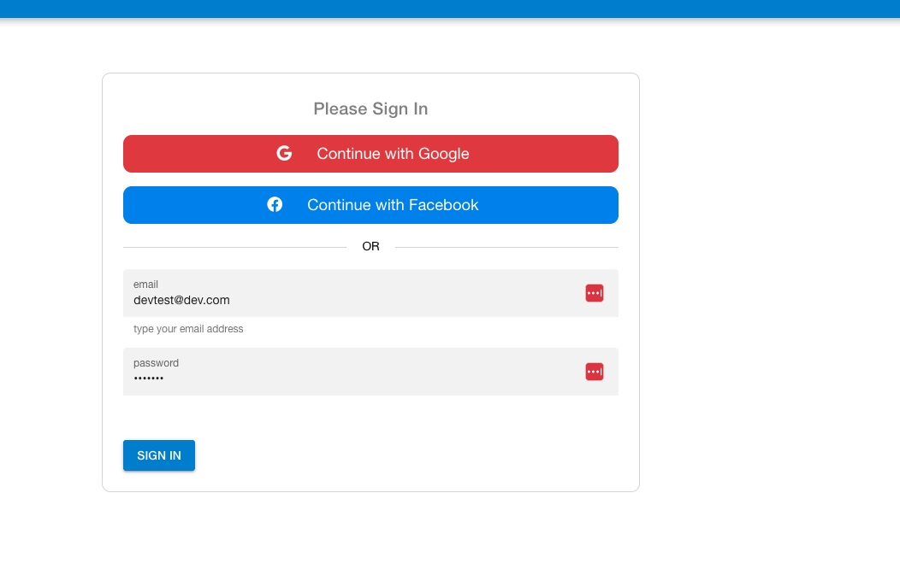
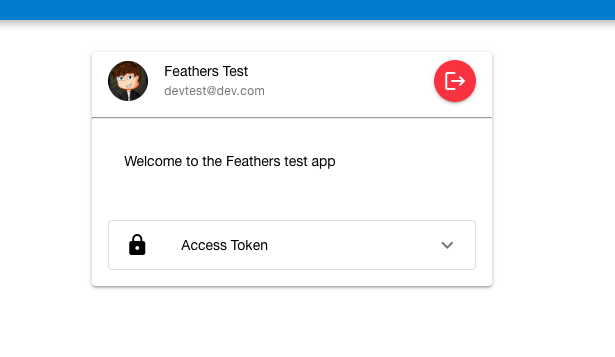
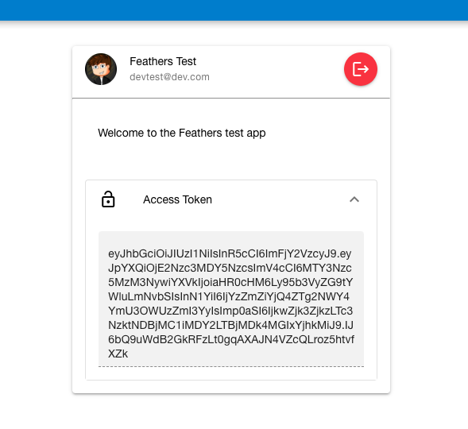

# feathers-test

## set up `.env` file

Save a copy of the [backend/src/.env.example](backend/src/../.env.example) as `backend/src/.env` and add env variables for `GOOGLE_KEY`, `GOOGLE_SECRET`, etc to register the `oauth` clients.

When complete, the `.env` file should look like this (except with real values):

```
GOOGLE_KEY=<some-key>.apps.googleusercontent.com
GOOGLE_SECRET=<some-secret>
FACEBOOK_KEY=<some-key>
FACEBOOK_SECRET=<some-secret>
GITHUB_KEY=
GITHUB_SECRET=
USE_SSL=1
MONGODB=mongodb://localhost:27017/feathers-test
```

## set up the backend

First, the backend needs to be set up and the database should get seeded:

```
cd backend
npm i
npm run seed
npm run bundle:client
npm run dev
```

## set up frontend

`cd` into the `feathers-test` folder and if the backend is up and running, install the compiled client library from the feathers backend, which will be available as `tgz` package. For more info, see the [feathersjs cli client docs](https://feathersjs.com/guides/cli/client.html):

```
// make sure you're in the "feathers-test" directory
cd ..
npm install https://localhost:3030/backend-0.0.0.tgz
npm run dev
```

## Screenshots

Socials or local auth page:



Current user page:



Show the access token:



# Vue 3 + TypeScript + Vite

This template should help get you started developing with Vue 3 and TypeScript in Vite. The template uses Vue 3 `<script setup>` SFCs, check out the [script setup docs](https://v3.vuejs.org/api/sfc-script-setup.html#sfc-script-setup) to learn more.

## Recommended IDE Setup

- [VS Code](https://code.visualstudio.com/) + [Volar](https://marketplace.visualstudio.com/items?itemName=Vue.volar) (and disable Vetur) + [TypeScript Vue Plugin (Volar)](https://marketplace.visualstudio.com/items?itemName=Vue.vscode-typescript-vue-plugin).

## Type Support For `.vue` Imports in TS

TypeScript cannot handle type information for `.vue` imports by default, so we replace the `tsc` CLI with `vue-tsc` for type checking. In editors, we need [TypeScript Vue Plugin (Volar)](https://marketplace.visualstudio.com/items?itemName=Vue.vscode-typescript-vue-plugin) to make the TypeScript language service aware of `.vue` types.

If the standalone TypeScript plugin doesn't feel fast enough to you, Volar has also implemented a [Take Over Mode](https://github.com/johnsoncodehk/volar/discussions/471#discussioncomment-1361669) that is more performant. You can enable it by the following steps:

1. Disable the built-in TypeScript Extension
   1. Run `Extensions: Show Built-in Extensions` from VSCode's command palette
   2. Find `TypeScript and JavaScript Language Features`, right click and select `Disable (Workspace)`
2. Reload the VSCode window by running `Developer: Reload Window` from the command palette.
